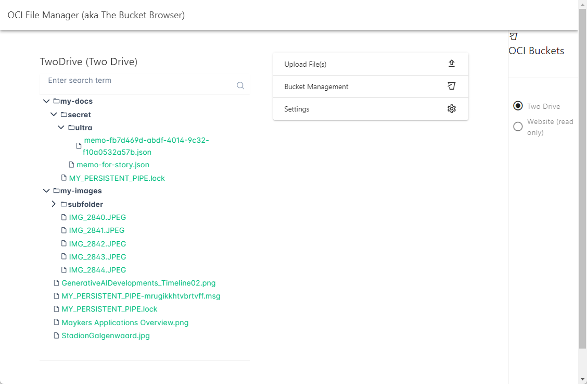
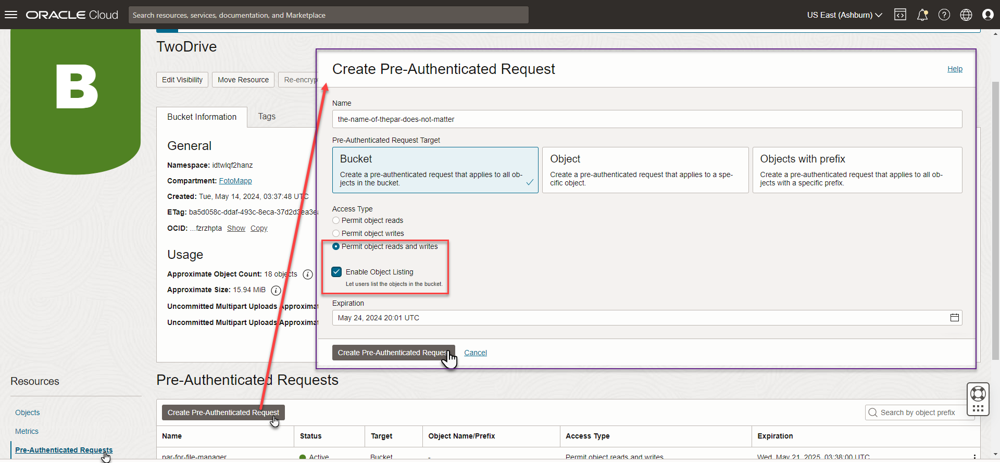
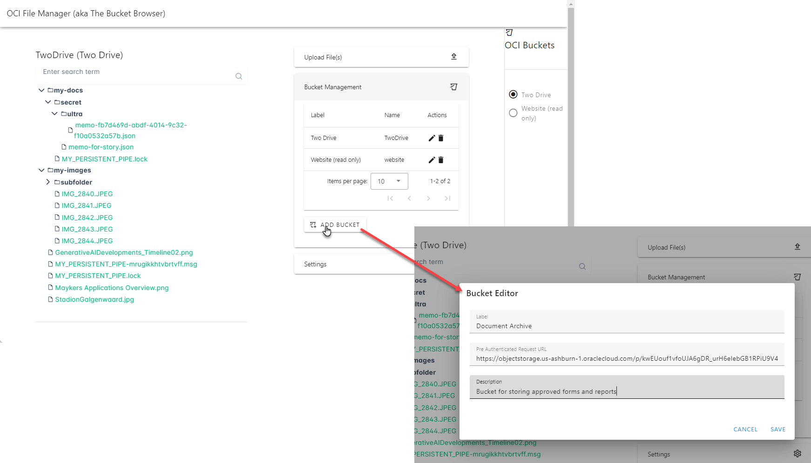
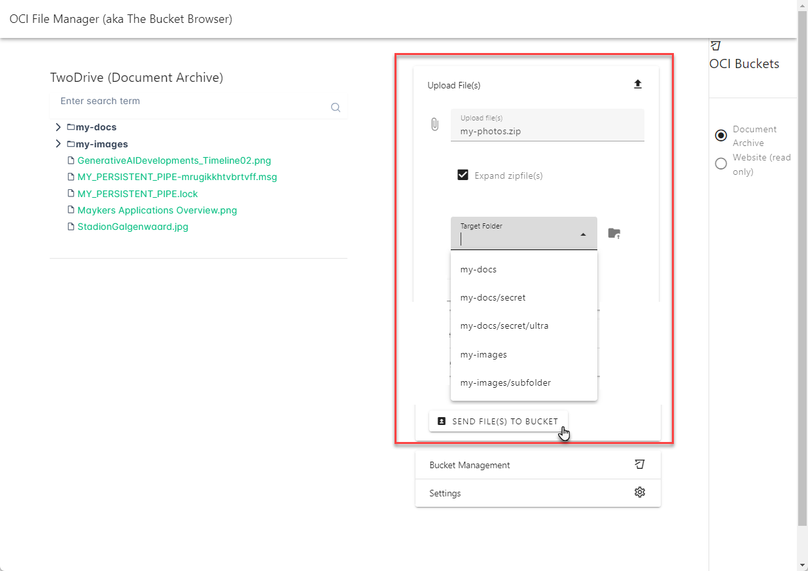
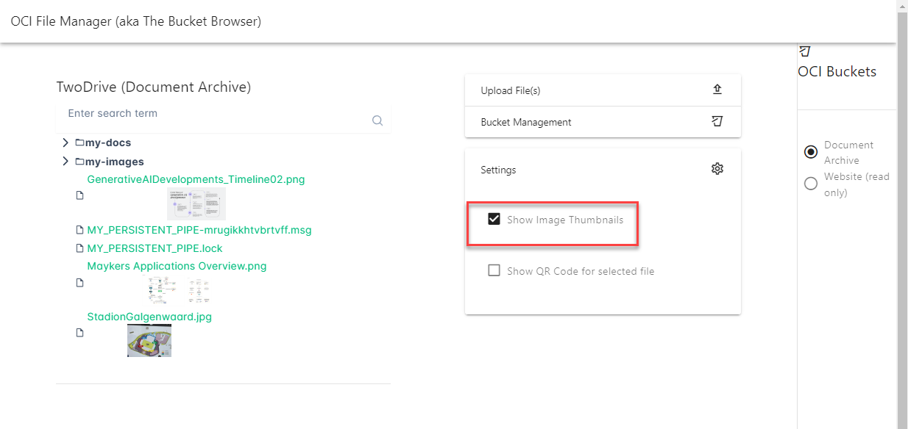
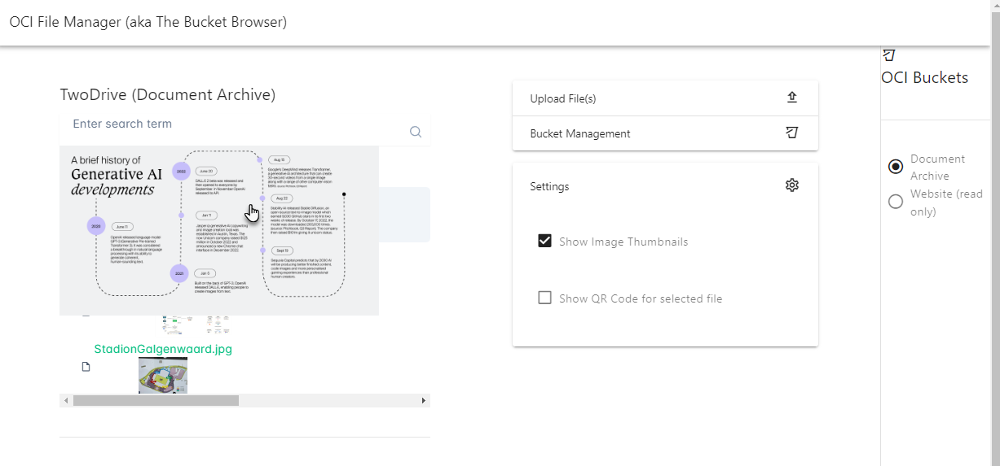
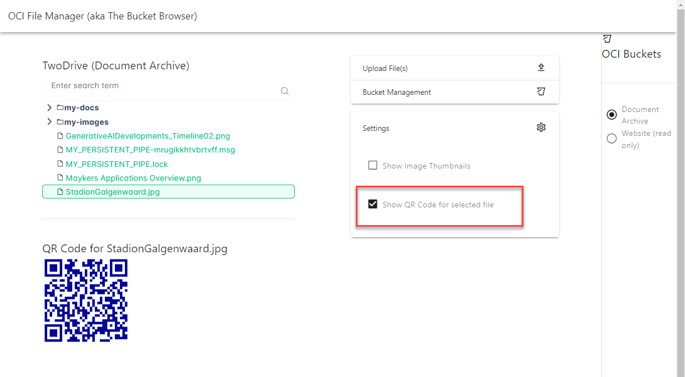

# OCI File Manager

The OCI File Manager is a simple static web application that provides a user interface to easily navigate the contents of your buckets on OCI Object Storage. In addition to browsing these buckets, you can download the files from the buckets and upload files to these buckets. The OCI File Manager leverages a Pre Authenticated Request (aka PAR) that you need to provide for each bucket you want to access through the app. The PAR requires at least read and list object privileges. In order to be able to upload files, the PAR also need write permissions.

The OCI File Manager is static web application that runs entirely in your browser. Once the sources are loaded, there is no more interaction with any backend service. The app stores bucket information in local storage in your browser - to enable you to easily access the buckets again the next time you use the app. Note: this information is stored in *your* browser, not outside your device.

The app shows a tree explorer for the folders and files in your bucket. The search field can be used to quickly locate a files with specific names. Each node in the tree is a link: when you click on the file name, the file is downloaded to your device. 


In the right side navigation area you will find radio buttons for all buckets you have added to the OCI File Manager. Choose the radio button for the bucket you want to explore.

## Pre Authenticated Request for a Bucket

This tool leverages the Pre Authenticated Request URL that allows direct GET and PUT access to the bucket - without any additional requirements for configuration of authorization. Anyone - or any tool - with the URL can get right to it. So be careful who you share it with.

To create the PAR, open the OCI Console and navigate to the bucket in the Object Storage section.



Click on Resources | Pre Authenticated requests. Then click on Create Pre Authenticated Request. Make sure that you select Bucket as the target, Pernmit object read and write as the access type and Enable Object Listing. Optionally edit the expiration date - the default is one week into the future. CLick on Create Pre Authenicated Request to save the PAR and get access to the URL.


Copy one of the two URLs presented - both will do the job. This URL is the key for the OCI File Manager app to unlock access to the bucket and read its files and upload new contents.

## Bucket Management

The Bucket Management panel is used for adding, editing and removing buckets. The information on buckets is held in memory and is saved to the local storage in your browser for ease of future use.
 

You can add new buckets - provide the Pre Authtenicated Request URL and a label and optionally a description. Buckets can be edited and removed.

## Uploading files
Files can be upload in the Upload File(s) panel. You can select one or more files from your device for uploading. If your uploading zip-files, you can specify if you want the zip file to be exploded during upload: every file in the archive is created as an individual entry in the bucket if you check the checkbox.


You can specify the target folder into which the files should be uploaded. You can select an already existing folder or define a new one. OCI Object Storage will treat slashes as additional levels of nesting. Note: if you decide to expand zip files and these contain folders, then these folders are also created in the target folder as nested folders. 

Press the button *Send file(s) to bucket* to make the upload happen. Note: if the PAR configured for this bucket does not have write permissions, then this action will fail.

## Show Thumbnail Images
In the Settings panel you can indicate that you want thumbnail images to be displayed for files of image types (gif, jpg, png). 



If you hover over these thumbnails, you will see an enlarged image.


## Generate QR Image
An extra feature in the OCI File Manager is the ability to have a QR Image generated for a file that is selected in the tree navigator. Using this QR Code, the file can be downloaded, for example on mobile devices that scan the QR Code. This a very fast way of getting documents from the bucket to your mobile phone and even from your laptop to your phone (upload from laptop to bucket, then generate QR Code and scan it with your phone).

The QR Codes are displayed only if you check the checkbox in the Settings panel:




# Develop and Build/Deploy/Run the OCI File Manager

You can access the application at [lucasjellema.github.io/oci-file-manager/](https://lucasjellema.github.io/oci-file-manager/). It is a static web application that runs entirely inside your browser. No information is sent from this application to any backend. Communication between the OCI File Manager app and your OCI Object Storage Buckets is only between your browser and those buckets.

## Local Hosting and Development

You can of course install the application in your own environment - to host it locally in an environment you fully control and also to modify and extend it. After cloning this GitHub repo, it is easy to install the required modules and start development.

```sh
npm install
```

### Compile and Hot-Reload for Development

```sh
npm run dev
```

## Compile and Minify for Production

```sh
npm run build
```

## Lint with [ESLint](https://eslint.org/)

```sh
npm run lint
```
