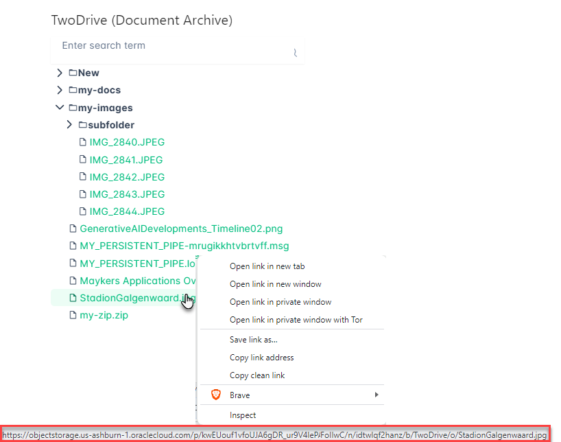
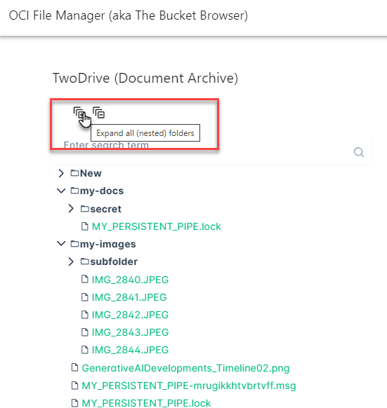
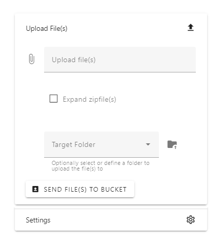
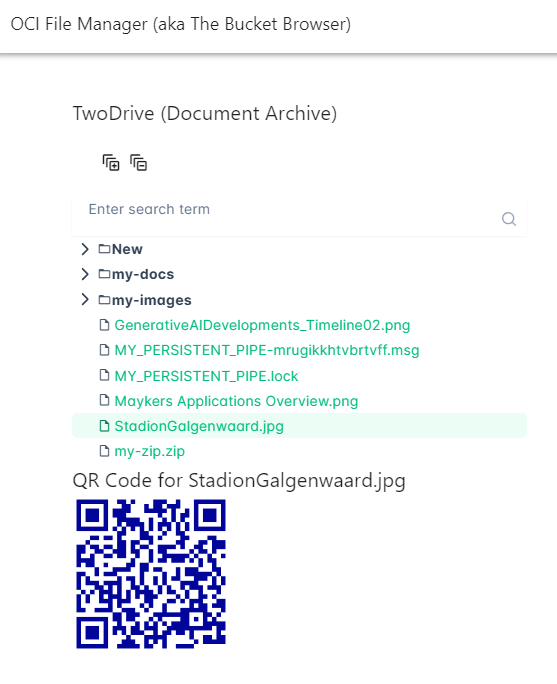
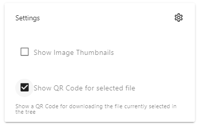

# Stepwise implementation of the OCI File Manager using Vue 3, Vuetify and PrimeVue

The OCI File Manager is a simple static web application that provides a user interface to easily navigate the contents of your buckets on OCI Object Storage. In addition to browsing these buckets, you can download the files from the buckets (one by one or bundled in zip files) and upload files to these buckets. The OCI File Manager leverages a Pre Authenticated Request (aka PAR) that you need to provide for each bucket you want to access through the app - and requires not other configuration. A simple URL or QR Code is enough to run the OCI File Manager and open the right bucket context and present the file tree explorer.


In an earlier article - https://technology.amis.nl/frontend/oci-object-storage-file-manager/ - I have introduced the bare bones implementation of the file manager, from the scaffold Vue 3 application to a simple web application with interaction with OCI Object Storage through HTTP requests using the Pre Authenticated Request (URL). 

The article demonstrates a number of interesting aspects:
* show some sort of folder structure for the files in the bucket
* show a thumbnail images for any file of an image type
* send an uploaded file to the OCI Bucket (for writable Pre Authenticated Requests)
* upload a zip file, extract the individual files and folders and PUT them in the OCI Bucket

Unfortunately, the application - though functional - has a very poor user experience. Not pretty, not appealing and  not that easy to work with. We can do a lot better.

This current article describes what was done to modify the original application and turn it into the functionally much richer and visuallu much more appealing application that it is right now. Import steps to go through:

* Vuetify the Vue 3 application - introduce Vuetify (an Open Source UI Library with beautifully handcrafted Vue Components) for a much enhanced User Interface
  * Create the high level grid structure for the page 
* Add the Tree component from PrimeVue (another open source UI library for Vue) - at the time of writing, Vuetify does not have a good enough Tree component, and PrimeVue does.
  * Turn the file names into the nested node collection needed to fuel the Tree component
  * Render nodes as downloadable links
  * Add Expand All/Collapse all icons  
* Add generation of QR Code for selected file
* Introduce Bucket Management
  * Save/Retrieve bucket details to Local Storage
  * Add Bucket Management panel
  * Add Radio Buttons to switch between buckets
* Add Deployment to GitHub Pages
* Add the ability to download multiple files in a single zip file
  * Create Download Panel
  * Allow Selection of Files and Folders
  * Collect selected files into a Zip file
  * Save the zip file with the specified name
  * Add Select All/Unselect All icons
* Allow Share URL feature to provide direct access to a Bucket through OCI File Manager using a single URL
  * Introduce logic to interpret query parameters
  * Add Share tab with label and permission checkboxes
  * Generate Share URL
  * Add QR Code for Share URL

# Vuetify the Vue 3 application
Introduce Vuetify (an Open Source UI Library with beautifully handcrafted Vue Components) for a much enhanced User Interface. 

First intall npm module:
```
npm install vuetify --save
npm install vuetify@next --save
npm install @mdi/font --save
```

Edit file `main.js`. Add import statements:
```
import 'vuetify/styles'
import '@mdi/font/css/materialdesignicons.css'
import { createVuetify } from 'vuetify'
import * as components from 'vuetify/components'
import * as directives from 'vuetify/directives'
```

and configure the app for using Vuetify:
```
const vuetify = createVuetify({
    components,
    directives,
})

app.use(vuetify)
```

These two steps make the Vuetify components and the associated styles and icons available in the Vue application.

Read the [Vuetify Docs](https://vuetifyjs.com/en/getting-started/installation/#existing-projects). See [Material Design Icons](https://pictogrammers.com/library/mdi/) for an overview of the icons that are available in the application through Vuetify.

## Create the high level grid structure for the page 
A very modest first stab at a more attractive UI is made in file `App.vue` with the following `template`:
```
  <v-app>
    <v-app-bar app>
      <v-toolbar-title>OCI File Manager (aka The Bucket Browser)
      </v-toolbar-title>
      <v-img src="/app-bar-background-conclusion.jpg" height="80"></v-img>
    </v-app-bar>
    <v-main>
      <div>
        <div v-for="file in  filesStore.files ">
          <span :title="'click to ' + (file.isExpanded ? 'collapse' : 'expand')" v-if="file.isFolder"
            @click="expandFolder(file)">{{ file.isExpanded ? '▼' : '▶' }}{{
          file.name }}</span>
          <div v-if="!file.isFolder && (!file.folderName || expandedFolders.includes(file.folderName))">
            <span v-if="file.folderName">&nbsp;&nbsp;&nbsp;&nbsp;</span>
            <a :href="filesStore.PAR + file.fullname">{{ file.name }}</a>
            
          </div>
        </div>

        <br />
        <h2>Upload File</h2>
        <v-file-input id="uploadedFile" label="Upload file(s)" @change="handleFileUpload" accept="*/*"
          :multiple="true"></v-file-input>
        <br /><br />

        <v-btn @click="submitData" prepend-icon="mdi-upload-box">Send file(s) to Bucket</v-btn>
      </div>
    </v-main>
  </v-app>
  ```
  In the next few steps, a more sophisticated layout is created using the Vuetify grid system - v-container and its child components -  and of course with the PrimeVue Tree component.

# Add the Tree component from PrimeVue 
PrimeVue is another open source UI library for Vue).At the time of writing, Vuetify does not have a good enough Tree component, and PrimeVue does.

To allow use of PrimeVue components in the application, these steps are required:

```
npm install primevue –save
```

Edit `main.js`:
```
import PrimeVue from 'primevue/config';
import 'primevue/resources/themes/aura-light-green/theme.css'
```
and subsequently make the App use PrimeVue:
```
app.use(PrimeVue)
```

PrimeVue components are not registered (application wide or at at all, unlike Vuetify). They need to be imported into any view/page/component that uses them.


## Produce the Nested Data Set to Drive the Tree 
Turn the file names into the nested node collection needed to fuel the Tree component. The PrimeVue Tree takes a collection of nodes as its input. And each node can have child nodes that in turn can each have children and so on. A node is a simple object with a few expected properties, including key, data, label 

In `filesStore.js`, the following code is created - note this is the longest and probably most complex piece of code. It consists of three parts:
* fetch list of all files through PAR
* create nested data structure for the files and folders parsed from the fetched list
* produce the node collection as required by the Tree component

```
const refreshFiles = () => {
    fetch(PAR.value, { method: 'GET' })
      .then(response => response.json())
      .then(data => {
        bucketContents.value = data.objects
        processFileObjects(data.objects)
      })
  }

const foldersInBucket = ref([])
const bucketContents = ref([])
const filesAndFolders = ref([])

const createNestedStructure = (paths) => {
    const root = { name: "root", nestedFolders: [], files: [] };
    paths.forEach((path) => {
      const parts = path.split('/');
      addPath(root, parts, path);
    });
    return root;
}

const addPath = (currentFolder, parts, fullPath) => {
    if (parts.length === 1) {
      // It's a file
      currentFolder.files.push({ name: parts[0], fullPath: fullPath });
    } else {
      // It's a folder
      const folderName = parts[0];
      let folder = currentFolder.nestedFolders.find(f => f.name === folderName);

      if (!folder) {
        folder = { name: folderName, nestedFolders: [], files: [] };
        currentFolder.nestedFolders.push(folder);
        // full path minus the part after the last slash
        const folderPath = fullPath.split('/').slice(0, -1).join('/');
        if (!foldersInBucket.value.includes(folderPath)) foldersInBucket.value.push(folderPath)
      }
      addPath(folder, parts.slice(1), fullPath);
    }
}

  const processFileObjects = (fileObjects) => {
    const nestedStructure = createNestedStructure(fileObjects.map(fileObject => fileObject.name));
    foldersInBucket.value = foldersInBucket.value.sort()
    filesAndFolders.value = nestedStructure
  }
```

Function getFilesTree produces the collection of nodes with child node collections that represent the files and folders in right structure as required by the Tree component. Note: custom properties can freely be added to the node objects. In custom templates, these properties can be accessed. 
```
  const processFolder = (folder, parentNode) => {
    if (folder.nestedFolders)
      for (const childFolder of folder.nestedFolders) {
        const folderNode = {
          key: childFolder.name + '-folder',
          label: childFolder.name,
          data: folder.name,
          icon: 'mdi mdi-folder-outline',
          nodeType: 'folder',
          type: 'folder',
          leaf: false,
          selectable: false,
          children: []
        }
        parentNode.children.push(folderNode)
        processFolder(childFolder, folderNode)

      }
    if (folder.files)
      for (const file of folder.files) {
        const fileNode = {
          key: file.fullPath,
          label: file.name,
          data: file.fullPath,
          icon: 'mdi mdi-file-outline',        
          nodeType: 'file',
          type: 'file',
          leaf: true,
          selectable: true,
          children: []
        }
        parentNode.children.push(fileNode)

      }
  }
  const getFilesTree = () => {
    const treeData = []
    if (filesAndFolders.value.nestedFolders)
      for (const folder of filesAndFolders.value.nestedFolders) {
        const folderNode = {
          key: folder.name + '-folder',
          label: folder.name,
          data: folder.name,
          icon: 'mdi mdi-folder-outline',
          nodeType: 'folder',
          type: 'folder',
          leaf: false,
          selectable: false,
          children: []
        }
        processFolder(folder, folderNode)
        treeData.push(folderNode)
      }
    if (filesAndFolders.value.files)
      for (const file of filesAndFolders.value.files) {
        const fileNode = {
          key: file.fullPath,
          label: file.name,
          data: file.fullPath,
          icon: 'mdi mdi-file-outline',          
          nodeType: 'file',
          type: 'file',
          leaf: true,
          selectable: true,
          children: []
        }
        treeData.push(fileNode)
      }
    return treeData
  }
```

Some constants and functions are exposed from the filesStore store:
```
  return { refreshFiles, , foldersInBucket, getFilesTree, PAR, setPAR }
```

The Tree - in file `App.vue` is now configured using the tree data:
```
 <Tree :value="filesTree" scrollable scrollHeight="700px" class="w-full md:w-30rem tree-override" 
       :filter="true" filterPlaceholder="Enter search term" >
```

The value attribute is associated with the computed value filesTree that is derived from the getFilesTree function. 

```
const filesTree = computed(() => {
  return filesStore.getFilesTree()
})
```

With scrollable and scrollHeight, we allow the tree to grow large for large numbers of files - while staying on the page in a scrollable panel. Through the filter attribute we add a search field on top of the tree that allows us to filter nodes in the tree by simply typing a search string. 

## Render nodes as downloadable links
To allow the user to download the files, the files should be presented as hyperlinks. Clicking the link will start the download of the file. When the tree is rendered, the nodes for files (not for folders) should be rendered as links.

The Tree component allows custom templates to be defined for specific node types. In this example, #file refers to the value of *file* for type in the tree nodes. If that is the value of the type property, the special template is used for rending the node - which shows the node as a link.  This change is made in `App.vue` 

```
<Tree .... >
  <template #default="slotProps">
    <b>{{ slotProps.node.label }}</b>
  </template>
  <template #file="slotProps">
    <a :href="bucketPAR + slotProps.node.data" target="_blank" rel="noopener noreferrer" class="text-700 hover:text-primary">{{ slotProps.node.label }}</a>
    <v-img height="50" :src="bucketPAR + slotProps.node.data" class="thumbnail"
                  v-if="(slotProps.node.data.toLowerCase().endsWith('.jpg') || slotProps.node.data.toLowerCase().endsWith('.gif') || slotProps.node.data.toLowerCase().endsWith('.png'))"></v-img>
  </template>
</Tree>


## Add Expand All/Collapse all icons  
A fairly simple feature to add: icons for expanding all folders and nested folders in the tree and for collapsing all currently expanded folders. All changes are in file `App.vue`

The icons are added like this:
```
<div v-if="selectedBucket">
  <v-icon @click="expandAll" icon="mdi-expand-all-outline" class="ml-4 mt-3" title="Expand all (nested) folders"></v-icon>
  <v-icon @click="collapseAll" icon="mdi-collapse-all-outline" class="ml-2 mt-3" title="Collapse all expanded (nested) folders"></v-icon>
</div>
```


The tree is given the expandedKeys attribute
```
<Tree :value="filesTree" ... v-model:expandedKeys="expandedKeys" >
```
The code required in the `<script>` section:
```
const expandedKeys = ref({});
const expandAll = () => {
  for (let node of filesTree.value) {
    expandNode(node);
  }

  expandedKeys.value = { ...expandedKeys.value };
};

const collapseAll = () => {
  expandedKeys.value = {};
};

const expandNode = (node) => {
  if (node.children && node.children.length) {
    expandedKeys.value[node.key] = true;

    for (let child of node.children) {
      expandNode(child);
    }
  }
};
```

# Expandable Panels for Settings, Upload and More
The UI has a set of expandable panels for various purposes. Some of these will become apparent later on. Let's for now discuss the Upload and Settings panels.

The overall page grid is created using the Vuetify container with a single row and two columns that each get half of the page real estate. The left half contains the tree, the right half the panels - using v-expansion-panels. Note: only one panel can be expanded at a time.

The Upload panel contains the components we saw before - to allow the use to upload one or multiple files (from client device to browser) and send it from browser to bucket.  

```
 <v-container fluid>
    <v-row>
        <v-col cols="6">
            <Tree :value="filesTree" ...></Tree>
        </v-col>
        <v-col cols=" 4" offset="1" mr="10">
            <v-expansion-panels :multiple="false">
              <v-expansion-panel title="Upload File(s)" collapse-icon="mdi-upload" expand-icon="mdi-upload-outline">
                <v-expansion-panel-text>
                  <v-file-input id="uploadedFile" label="Upload file(s)" @change="handleFileUpload" accept="*/*"
                    :multiple="true"></v-file-input>
                  <v-checkbox v-model="expandZipfiles" label="Expand zipfile(s)"
                    hint="Submit files in zip archive one by one" class="ma-10 mt-2 mb-5"></v-checkbox>
                  <v-combobox v-model="targetFolder" :items="filesStore.foldersInBucket" label="Target Folder"
                    hint="Optionally select or define a folder to upload the file(s) to"
                    append-icon="mdi-folder-arrow-up" persistent-hint class="ma-10 mt-2 mb-5" </v-combobox>
                    <v-btn @click="submitData" prepend-icon="mdi-upload-box" mt="30">Send file(s) to Bucket</v-btn>
                    <v-img src="mdi-folder-outline"></v-img>
                </v-expansion-panel-text>
              </v-expansion-panel>
              <v-expansion-panel title="Settings" collapse-icon="mdi-cog-outline" expand-icon="mdi-cog-outline">
                <v-expansion-panel-text>
                  <v-checkbox v-model="showImageThumbnails" label="Show Image Thumbnails"
                    hint="Show thumbnail images in file tree for files of type jpg, gif, png"
                    class="mt-2 "></v-checkbox>                 
                </v-expansion-panel-text>
              </v-expansion-panel>
            </v-expansion-panels>
        </v-col>
    </v-row>
</v-container>
```


The JavaScript that supports the components in the expansion panels is roughly the following:
```
const targetFolder = ref(null)
const expandZipfiles = ref(false)
const showImageThumbnails = ref(false) // toggle for showing thumbnails in file tree for images 

const submitData = () => {
  const fileInput = document.getElementById('uploadedFile');
  const files = fileInput.files;
  for (let i = 0; i < files.length; i++) {
    const file = files[i];
    if (file) {
      if (expandZipfiles.value && file.name.toLowerCase().endsWith('.zip')) {
        const zip = new JSZip();
        zip.loadAsync(file).then(async (contents) => {
          const files = Object.values(contents.files);
          for (const file of files) {
            const blob = await zip.file(file.name).async('blob')
            const relativePath = (targetFolder.value ? targetFolder.value + '/' : '') + (file.dir ? file.dir + '/' + file.name : file.name)
            filesStore.submitBlob(blob, relativePath)
          }
        })
      } else {
        filesStore.submitBlob(file, (targetFolder.value ? targetFolder.value + '/' : '') + file.name)
      }
    }
  }
  fileInput.value = ''
}

```

# Add generation of QR Code for selected file
When a file is selected in the tree file explorer, then a QR Code is generated and displayed under the tree. This QR Code contains a direct download URL: when the code is scanned for example on a mobile device this results typically in the file being opened on the device. Through this QR Code, it becomes exceedingly simple to get a file from a bucket on Oracle Cloud to your phone.

To generate a QR Code, we make use of a popular library called `qrcode`, to be installed with
```
npm install qrcode --save
```

In file `App.vue`, a number of changes need to be made. First import the library:
```
import QRCode from 'qrcode'
```

Next, define a function `renderQRCode`. This function is invoked with a string (muyurl) and generates a QRCode that contains that string. The image of the QRCode is rendered in the HTML element with id *canvas* that is supposed to be of type canvas.

```
const renderQRCode = (myurl) => {
  var opts = {
    errorCorrectionLevel: 'H',
    type: 'image/jpeg',
    quality: 0.3,
    margin: 1,
    scale: 5,
    color: {
      dark: "#010599FF",
      light: "#FFFFFF"
    }
  }
  var canvas = document.getElementById('canvas')

  QRCode.toCanvas(canvas, myurl, opts, function (error) {
    if (error) console.error(error)
  })
}
```

The function is invoked when a file node is selected in the tree. The files nodes already have a `selectable:true` property. The tree is extended with event handlers for node-select and node-unselect. Under the tree is a new div element that shows a header with the name of the selected file and a canvas element that will contain and display the QR Code :
```
 <Tree :value="filesTree" ...  selectionMode="single" @node-select="nodeSelect" @node-unselect="nodeUnselect">
</Tree>
<div v-if="showQRCode ">
    <h2 v-if="qrcodeFile">QR Code for {{ qrcodeFile }}</h2>
    <canvas id="canvas"></canvas>
</div>
```


The functions nodeSelect and nodeUnselect:
```
const nodeSelect = (node) => {
  if (node.nodeType === 'file') {
    const url = filesStore.PAR.value + node.data
    qrcodeFile.value = node.data
    renderQRCode(url)
  }
}

const nodeUnselect = (node) => {
  const canvas = document.getElementById('canvas')
  if (canvas) canvas.width = canvas.width; // clears the canvas content
  qrcodeFile.value = null
}
```

Two variables are introduced as well:
```
const showQRCode = ref(false)
const qrcodeFile = ref(null)
```

The first one is a boolean that indicates whether QR Code should indeed be displayed when a file is selected. The second one contains the name of the file for which currently a QR Code is displayed.

The toggle *showQRCode* is managed by the user in a new checkbox in the Settings Panel:
```
 <v-expansion-panel title="Settings" collapse-icon="mdi-cog-outline" expand-icon="mdi-cog-outline">
    <v-expansion-panel-text>
        ...
        <v-checkbox v-model="showQRCode" label="Show QR Code for selected file"
                    hint="Show a QR Code for downloading the file currently selected in the tree" class=""></v-checkbox>
    </v-expansion-panel-text>
</v-expansion-panel>
```              



# Introduce Bucket Management
  * Save/Retrieve bucket details to Local Storage
  * Add Bucket Management panel
  * Add Radio Buttons to switch between buckets

# Add Deployment to GitHub Pages

# Add the ability to download multiple files in a single zip file
  * Create Download Panel
  * Allow Selection of Files and Folders
  * Collect selected files into a Zip file
  * Save the zip file with the specified name
  * Add Select All/Unselect All icons


# Allow Share URL feature to provide direct access to a Bucket through OCI File Manager using a single URL
  * Introduce logic to interpret query parameters
  * Add Share tab with label and permission checkboxes
  * Generate Share URL
  * Add QR Code for Share URL

# Resouces

Code demonstrated in this article is in this GitHub Repository https://github.com/lucasjellema/oci-file-manager

My earlier article: First steps in creating a Vue 3 Static Web Application (MVP) as File Manager for OCI Object Storage - OCI Object Storage File Manager - https://technology.amis.nl/frontend/oci-object-storage-file-manager/

Bulk delete all objects in an Object Storage bucket - https://docs.oracle.com/en-us/iaas/Content/Object/Tasks/bulk-delete-object.htm – the command to use: 
oci os object bulk-delete --bucket-name <bucket-name>

Vuetify – Homepage - https://vuetifyjs.com/

Add Vuetify to an existing project: https://vuetifyjs.com/en/getting-started/installation/#existing-projects

Material Design Icon collection - https://pictogrammers.com/library/mdi/

PrimeVue Tree Component - https://primevue.org/tree/

QRCode JavaScript library - https://davidshimjs.github.io/qrcodejs/ and an introductory article on how to use it https://www.turing.com/kb/creating-qr-code-using-js

Interaction with Session Storage - https://dev.to/grahammorby/persist-data-with-vue-3-38pc


  * Turn the file names into the nested node collection needed to fuel the Tree component
  * Render nodes as downloadable links
  * Add Expand All/Collapse all icons  